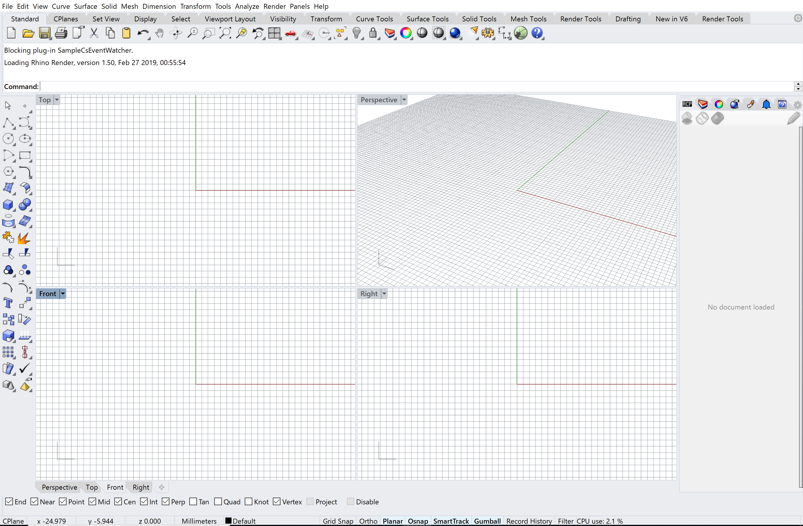
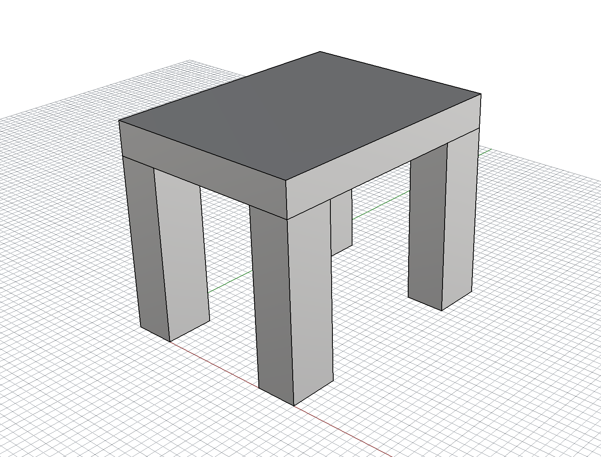

# CAD 図法演習Ⅰ（前期） 第02回

## 本日の内容

- RhinocerosのUI
- コマンド入力について
- 簡易な図形を作る

## RhinocerosのUI

- ナビゲーション
- 単位設定
- レイヤー
- プロパティ
- ツールバー
- スナップオプション

## コマンド入力について

- 【box】
- 【distance】
- 【mirror】
- 【move】
- 【copy】

## 簡易な図形を作る

## 参考

- 出席、レジュメ・ファイル置き場：https://classroom.google.com
- Google Classroomのクラスコード：rezc5i

## 出席

Google Classroomで時間内に出席届けを出す。

